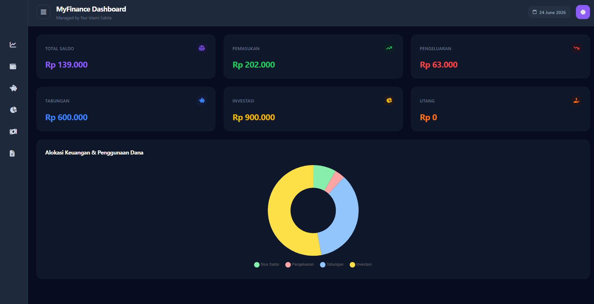

<h1 align="center">
  💰 MyFinance
</h1>

<p align="center">
  A modern personal finance tracker built with PHP and MySQL to manage your savings and budget efficiently.
</p>

<p align="center">
  
  
  
</p>

---

## ✨ About Project

MyFinance is a personal finance management platform built as part of my learning journey in web development.

The application allows users to track their financial targets, manage transactions, and monitor their savings through a simple and modern interface.

---

## 🚀 Features

* 📈 Financial target tracking
* 💳 Transaction management
* 📋 Debt and Investment tracking
* 🌙 Switch between dark and light mode
* 📱 Responsive interface
* 💾 MySQL database integration

---

## 🛠️ Built With

* PHP Native
* MySQL
* HTML5
* CSS3 (Tailwind CSS)
* JavaScript
* XAMPP

---

## 📂 Project Structure

```bash
myfinance/
│
├── screenshots/
├── assets/
├── includes/
├── pages/
├── index.php
└── README.md

```
## 📸 Screenshots

### Dashboard

<p align="center">
  
</p>

## 🎯 Learning Goals

* Understanding PHP and MySQL integration
* Learning session management
* Practicing database management
* Building a complete responsive web application from scratch

---

## 👩🏻‍💻 Author

**Nur Islami Sabila**

Frontend Developer & Informatics Student Candidate from Indonesia 🇮🇩

> "Learning by building, growing by creating."

---

⭐ If you like this project, don't forget to give it a star.
