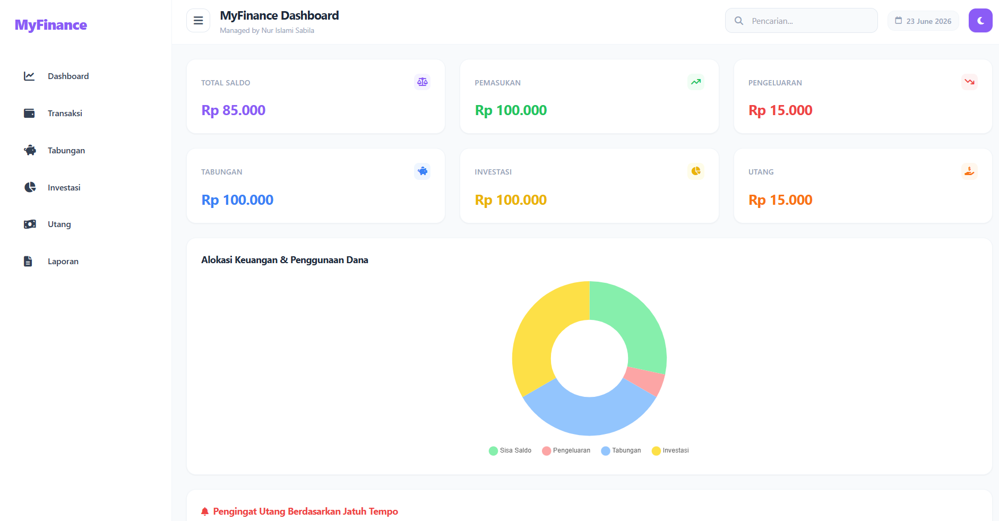

# MyFinance

A modern personal finance tracker built with **PHP** and **MySQL**, designed to help users manage savings, transactions, and financial goals through an intuitive web interface.

  
  
  

---

## Overview

MyFinance is a personal finance management platform created to explore full-stack web development concepts using PHP and MySQL. The application focuses on organizing financial activities, tracking progress toward savings goals, and providing a simple yet modern experience for managing personal finances.

---

## Features

* Financial target and savings tracking
* Transaction management system
* Debt and investment monitoring
* Dashboard with financial summaries
* Dark and light mode support
* Responsive user interface
* Multi-language support
* MySQL database integration

---

## Technologies

| Technology   | Description                              |
| ------------ | ---------------------------------------- |
| PHP Native   | Core server-side programming language    |
| MySQL        | Relational database management system    |
| HTML5        | Structure and content of the application |
| Tailwind CSS | Modern utility-first CSS framework       |
| JavaScript   | Interactive client-side functionality    |
| XAMPP        | Local development environment            |

---

## Screenshots

### Dashboard

  

---

## Author

<strong>Nur Islami Sabila</strong> 
Informatics Engineering Student from Indonesia.

<blockquote>
Learning by building, growing by creating.
</blockquote>

If you found this project helpful, consider giving it a ⭐ to support the repository.

